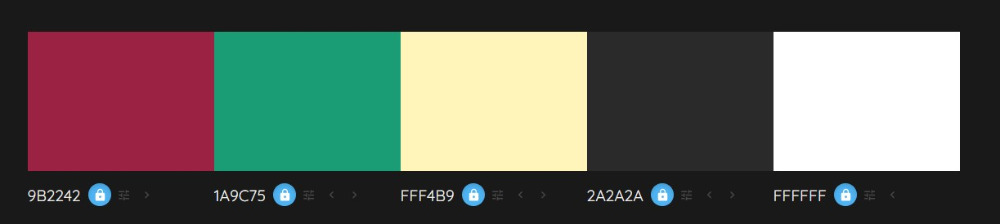
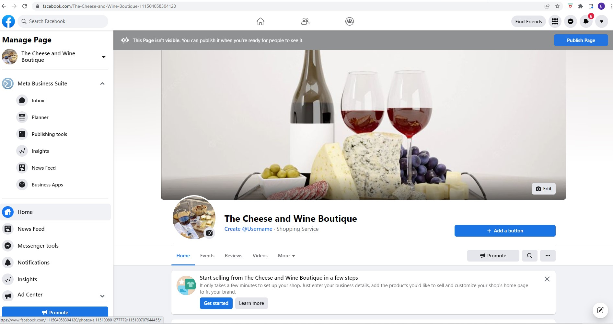
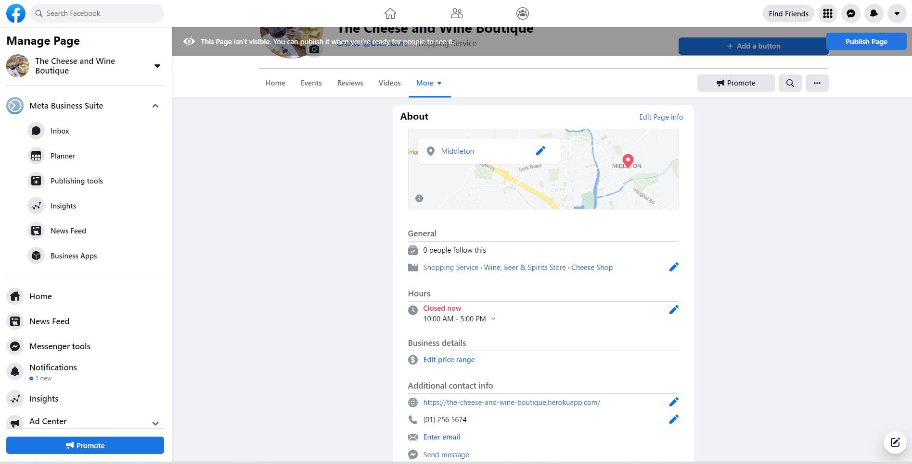
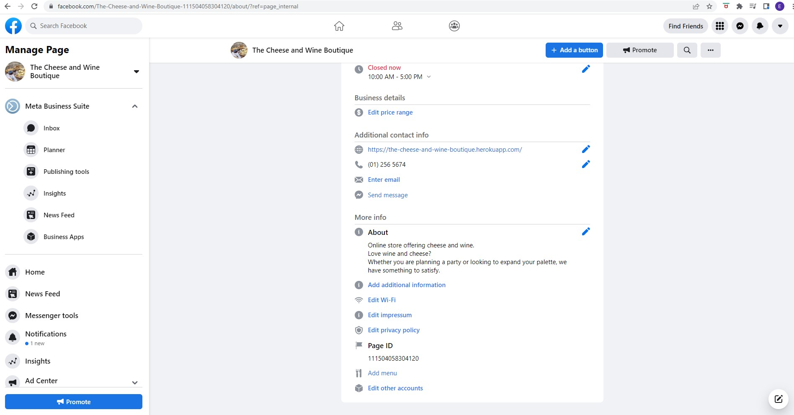
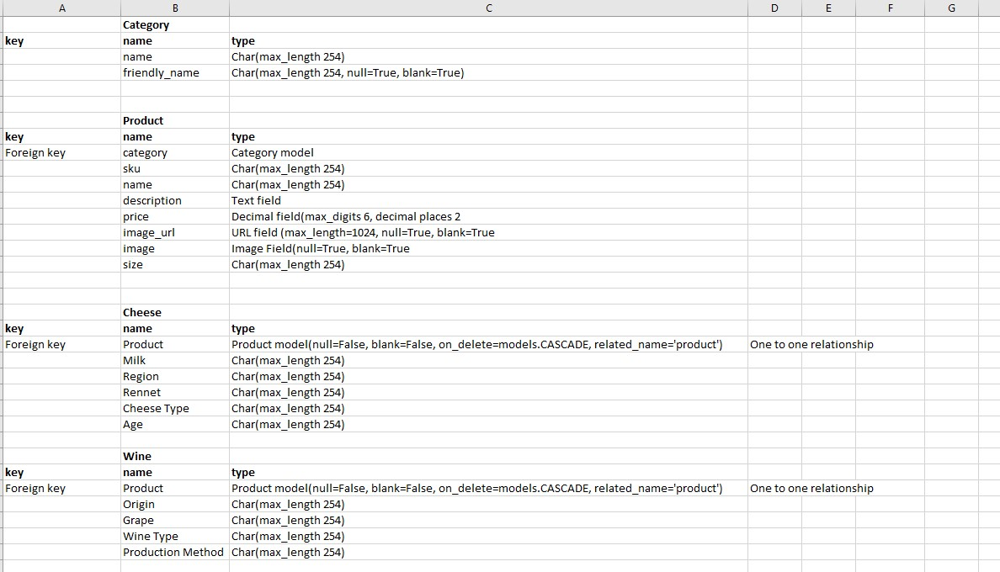
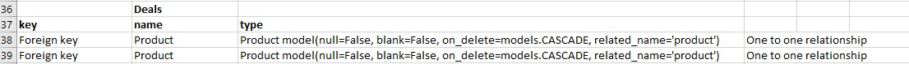
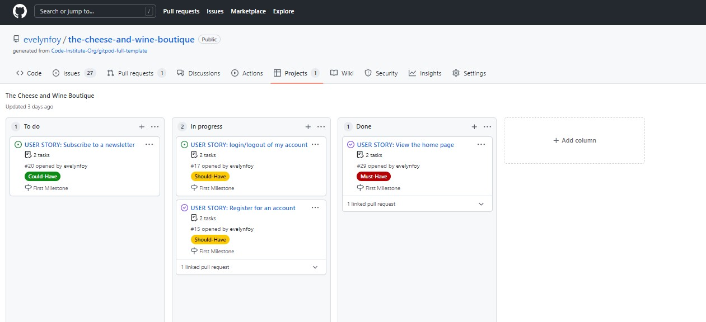
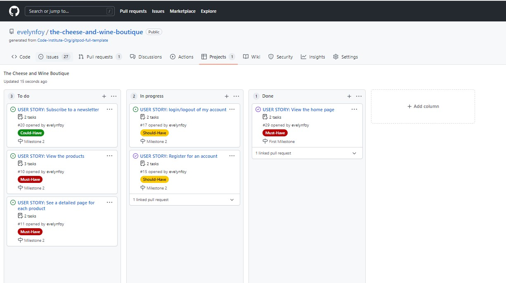

# The Cheese and Wine Boutique

<h2 align="center">Am I Responsive Screen Shot</h2> 

[View the live project here.](https://the-cheese-and-wine-boutique.herokuapp.com/)

## User Experience (UX)

### Purpose

 
The purpose of this project is to build an e-commerce site for the fictional cheese and wine business of the "Wilsons".

They import exclusive cheese and wines from all over the world and need an online outlet which displays their wares and provides     
a secure means for customers to buy them.

One of their selling points is that they offer cheese and wine deals of a selected wine and cheese package sold together for a discounted price.    
This is to encourage customers to try new products.

They also want to be able to offer a newsletter telling their customers all about the latest products they have discovered and are keen to share.
  
 

### Target Audience
The target audience will be adults looking to explore the world of cheese and wine.  

They will be curious about new offerings and combinations they have not tried before. They may want advice on what to choose    
and so will need to be able to contact the site owners.

They would be interested in trying the cheese and wine package deals or new suggestions in a newsletter.

The site’s audience would also be people looking for gifts or to buy for a party.

 

### User stories by Epic

-   #### EPIC - Home App

    As a **(role)** I can **(capability)**, so that **(received benefit)**
    | No. | As a **(role)**        | I can **(capability)**         | so that **(received benefit)**  |
    | --- | ------------- |-------------| -----|
    | [#15](https://github.com/evelynfoy/the-cheese-and-wine-boutique/issues/15)  | Shopper |  register for an account | I can have a personal account and be able to view my profile |
    | [#17](https://github.com/evelynfoy/the-cheese-and-wine-boutique/issues/17)  | Shopper |  login/logout of my account | I can access my personal profile |
    | [#18](https://github.com/evelynfoy/the-cheese-and-wine-boutique/issues/18)  | Shopper |  recover my password | I can recover if I forget it |
    | [#19](https://github.com/evelynfoy/the-cheese-and-wine-boutique/issues/19)  | Shopper |  receive an email confirmation after registering | I can be confident my account has been created |
    | [#20](https://github.com/evelynfoy/the-cheese-and-wine-boutique/issues/20)  | Shopper |  subscribe to a newsletter | I can get it sent out to me |
    | [#29](https://github.com/evelynfoy/the-cheese-and-wine-boutique/issues/29)  | Shopper |  view the home page  | I can judge if I am interested

-   #### EPIC - Products App

    As a **(role)** I can **(capability)**, so that **(received benefit)**
    | No. | As a **(role)**        | I can **(capability)**         | so that **(received benefit)**  |
    | --- | ------------- |-------------| -----|
    |  [#1](https://github.com/evelynfoy/the-cheese-and-wine-boutique/issues/1)  | Store Owner | add a cheese product | I can sell it in my store |
    |  [#2](https://github.com/evelynfoy/the-cheese-and-wine-boutique/issues/2)  | Store Owner | edit a cheese product | I can update the details, price etc |
    |  [#3](https://github.com/evelynfoy/the-cheese-and-wine-boutique/issues/3)  | Store Owner |  delete a cheese product | I can stop offering it for sale |
    |  [#4](https://github.com/evelynfoy/the-cheese-and-wine-boutique/issues/4)  | Store Owner |  add a wine product | I can sell it in my store |
    |  [#5](https://github.com/evelynfoy/the-cheese-and-wine-boutique/issues/5)  | Store Owner |  edit a wine product | I can keep the details accurate |
    |  [#6](https://github.com/evelynfoy/the-cheese-and-wine-boutique/issues/6)  | Store Owner |  delete a wine product | I can stop offering it for sale |
    |  [#7](https://github.com/evelynfoy/the-cheese-and-wine-boutique/issues/7)  | Store Owner |  add a wine and cheese deal | I can sell it in my store |
    |  [#8](https://github.com/evelynfoy/the-cheese-and-wine-boutique/issues/8)  | Store Owner |  edit a wine and cheese deal | I can keep the details accurate |
    |  [#9](https://github.com/evelynfoy/the-cheese-and-wine-boutique/issues/9)  | Store Owner |  delete a wine and cheese deal | I can stop offering it for sale |
    | [#10](https://github.com/evelynfoy/the-cheese-and-wine-boutique/issues/10)  | Shopper |  view the products | I can choose something to buy |
    | [#11](https://github.com/evelynfoy/the-cheese-and-wine-boutique/issues/11)  | Shopper |  see a detailed page for each product | I can see all the details for it |
    | [#12](https://github.com/evelynfoy/the-cheese-and-wine-boutique/issues/12)  | Shopper |  sort the list of available products | I can easily find the best choice |
    |[#13](https://github.com/evelynfoy/the-cheese-and-wine-boutique/issues/13)  | Shopper |  sort a specific category of product  | I can find the best choice of wine or cheese |
    | [#14](https://github.com/evelynfoy/the-cheese-and-wine-boutique/issues/14)  | Shopper |  search for a product by name or description  | I can more easily find something more specific |
    
-   #### EPIC - Bag App

    As a **(role)** I can **(capability)**, so that **(received benefit)**
    | No. | As a **(role)**        | I can **(capability)**         | so that **(received benefit)**  |
    | --- | ------------- |-------------| -----|
    | [#21](https://github.com/evelynfoy/the-cheese-and-wine-boutique/issues/21)  | Shopper |  add products to a virtual shopping bag | I can purchase more than one item |
    | [#22](https://github.com/evelynfoy/the-cheese-and-wine-boutique/issues/22)  | Shopper |  see a running total of the value of my shopping bag | I can decide if I want to spend more |
    | [#23](https://github.com/evelynfoy/the-cheese-and-wine-boutique/issues/23)  | Shopper |  see all the items in my shopping bag | I can ensure I am happy to proceed |
    | [#24](https://github.com/evelynfoy/the-cheese-and-wine-boutique/issues/24)  | Shopper |  adjust the quantity of any product in my bag | I can decide on the right amount |
    | [#25](https://github.com/evelynfoy/the-cheese-and-wine-boutique/issues/25)  | Shopper |  remove products from my bag | I can decide not to buy them |

-   #### EPIC - Checkout App

    As a **(role)** I can **(capability)**, so that **(received benefit)**
    | No. | As a **(role)**        | I can **(capability)**         | so that **(received benefit)**  |
    | --- | ------------- |-------------| -----|
    | [#26](https://github.com/evelynfoy/the-cheese-and-wine-boutique/issues/26)  | Shopper |  view an order confirmation after checkout | I can ensure I haven't made a mistake |
    | [#27](https://github.com/evelynfoy/the-cheese-and-wine-boutique/issues/27)  | Shopper |  purchase a product securely | I can get it sent out to me |
    | [#28](https://github.com/evelynfoy/the-cheese-and-wine-boutique/issues/28)  | Shopper |  receive an email confirmation after purchasing | I can have a record of the transaction |

-   #### EPIC - Profile App
    
    As a **(role)** I can **(capability)**, so that **(received benefit)**
    | No. | As a **(role)**        | I can **(capability)**         | so that **(received benefit)**  |
    | --- | ------------- |-------------| -----|
    | [#16](https://github.com/evelynfoy/the-cheese-and-wine-boutique/issues/16)  | Shopper |  have my own user profile | I can see my orders and payment information |

### Design
-   #### Colour Scheme
    The main colour I have chosen for the site is wine red, representative of what the site sells.    
    It is a warm decadent colour which tones well with a cream cheese colour also reflecting what the site sells.  
    I have added an additional green colour, advertised on [colorcode.io](https://colorcodes.io/red/wine-red-color-codes/)  as a complementary colour for the wine red, to add an extra contrasting colour.   
    I have kept the body white with dark writing for good contrast.

    Here is the colour palete generated on [Colormind](http://colormind.io/).
       

-   #### Typography
    I decided to go for the [Merienda One](https://fonts.google.com/specimen/Merienda+One?query=Merienda+One#about) font from [Google fonts](https://fonts.google.com/) for the logo to give a flourish.     
    According to Google fonts 'It is ideal for headlines which call for height, as its strokes resemble those of a brush and deliver freshness and a dynamic touch in the development of words.'    
    I decided to go with [Open Sans](https://fonts.google.com/specimen/Open+Sans?query=Open+sans#about) font for the rest of the site as it is easy to read and looks good.     
    According to [Google fonts](https://fonts.google.com/) 'It is optimized for print, web, and mobile interfaces, and has excellent legibility.    
                 
-   #### Imagery
    I will add icons from [font awesome](https://fontawesome.com/) where appropriate and photos of the products on sale.
    I will also add an appropriate image to the home page featuring cheese and wine to create interest and ensure the purpose of the site is immediately evident.    

### Wireframes
The wireframes below were generated using [Balsamic](https://balsamiq.com/wireframes/ "Balsamic").
-   #### [Home - Desktop](docs/wireframes/home-desktop.png "Home Desktop wireframe")
-   #### [Home - Phone](docs/wireframes/home-phone.png "Home Phone wireframe")
-   #### [Home - Tablet](docs/wireframes/home-tablet.png "Home Tablet wireframe")
-   #### [Product Description - Desktop](docs/wireframes/product-description-desktop.png "Product Description Desktop wireframe")
-   #### [Product Description - Phone - Tablet](docs/wireframes/product-description-phone-tablet.png "Product Description Phone & Tablet wireframe")
-   #### [Products - Desktop](docs/wireframes/products-desktop.png "Product Description Desktop wireframe")
-   #### [Products - Phone - Tablet](docs/wireframes/products-phone-tablet.png "Products Phone & Tablet wireframe")
-   #### [Register](docs/wireframes/register.png "Register wireframe")
-   #### [Login](docs/wireframes/login.png "Login wireframe")
-   #### [View Basket - Desktop](docs/wireframes/basket-desktop.png "View Basket Desktop wireframe")
-   #### [View Basket - Phone - Tablet](docs/wireframes/basket-phone-tablet.png "View Basket Phone & Tablet wireframe")

### Marketing Strategy and E-commerce Business Model
The Ecommerce Business Model for this project is Business to Consumer as it is for a business targeting ordinary people as customers.

The marking strategy I consider best meets the needs of the Wilsons is as follows:
-   Use of SEO    
    I will employ SEO optimisation techniques and implementations such as semantic markup, keywords and metadata so the site ranks highly with Google.    
    I will also include a site map and robots.txt file to assist the search engines.
-   Content marketing    
    This will be achieved by using keywords in the content of the site and also offering interesting deals which will change constantly, provide interest and promote various products.
-   Email Marketing    
    A form will be provided where visitors can sign up for a newsletter which will contain interesting information about new products and offerings.
-   Social Media Marketing    
    A link to the business' Social Media pages will be included to encourage organic growth.    
    These screenshots were taken from the mock facebook page I created for this project.
    
    
    
    

  

## Project Structure

 

### Data Schema

###     
###     

&nbsp;  

### Models

#### Category

| Name          | Type | Key       | Other          |
|---------------|------|-----------|----------------|
| name          |      | CharField | max_length=254 |
| friendly_name |      | CharField | max_length=254 |

#### Product

| Name        | Type            | Key                | Other                                  |
|-------------|-----------------|--------------------|----------------------------------------|
| category    |                 | ForeignKey(Animal) | on_delete=models.CASCADE               |
| sku         | CharField       |                    | max_length=254, null=True, blank=True  |
| name        | CharField       |                    | max_digits=6, decimal_places=2         |
| description | TextField       |                    |                                        |
| price       | DecimalField    |                    | max_digits=6, decimal_places=2         |
| size        | CharField       |                    | max_length=254                         |
| image_url   | URLField        |                    | max_length=1024, null=True, blank=True |
| image       | CloudinaryField |                    | default='placeholder'                  |

#### Cheese

| Name        | Type      | Key                 | Other                                |
|-------------|-----------|---------------------|--------------------------------------|
| Product     |           | ForeignKey(Product) | on_delete=models.CASCADE             |
| Milk        | CharField |                     | max_length=20, null=True, blank=True |
| Region      | CharField |                     | max_length=20, null=True, blank=True |
| Rennet      | TextField |                     | max_length=20, null=True, blank=True |
| Cheese Type | CharField |                     | max_length=20, null=True, blank=True |
| Age         | CharField |                     | max_length=20, null=True, blank=True |

#### Wine

| Name              | Type      | Key                 | Other                                             |
|-------------------|-----------|---------------------|---------------------------------------------------|
| Product           |           | ForeignKey(Product) | on_delete=models.CASCADE, one to one relationship |
| Origin            | CharField |                     | max_length=20, null=True, blank=True              |
| Grape             | CharField |                     | max_length=20, null=True, blank=True              |
| Wine Type         | TextField |                     | max_length=20, null=True, blank=True              |
| Production Method | CharField |                     | max_length=20, null=True, blank=True              |

#### Deal

| Name    | Type | Key                 | Other                                             |
|---------|------|---------------------|---------------------------------------------------|
| Product |      | ForeignKey(Product) | on_delete=models.CASCADE, one to one relationship |
| Product |      | ForeignKey(Product) | on_delete=models.CASCADE, one to one relationship |

### Agile Methodology
[Github issues](https://github.com/evelynfoy/the-cheese-and-wine-boutique/issues) were used to manage the development of this project. I set up a [project backlog](https://github.com/evelynfoy/the-cheese-and-wine-boutique/milestones) milestone containing all the issues at the start.    
Then I set up a [kanban board]( https://github.com/evelynfoy/the-cheese-and-wine-boutique/projects/1) for the project and each week I created a new milestone to use to complete an agile sprint and moved in a number of issues to complete.    
I prioritised the issues according to the MoSCoW technique and labeled them as such. Any issues outstanding at the end of the sprint were moved to the next sprint.    
Here is a screenshot at the end of the first sprint and the beginning of the second.    
 

I used branches to implement all user stories and pull requests to merge the work into the main branch.
Minor tweaks and documentation was done on the main branch. 

## Features
### Existing Features
The site consists of a home page featuring a hero image, an inspirational text area, a newsletter signup form and a footer.    
It has a navbar which displays the site name and options to register, login, shop or view the contents of a virtual shopping basket.    
The shop option displays the product available for purchase at the store and allows the user to add a specified quantity of the item to the virtual shopping basket.    
There is a running total of the basket displayed at all times and the contents viewed or adjusted as required.    
From the basket the checkout button provides the means for the user to purchase the items in a secure way using stripe payments.
The user can register and login to view their orders and save their personal information or shop annoynmously.
The site owner can also maintain the product list once logged in. 

## Technologies Used

### Languages
* HTML
* CSS
* Python

### Libraries & Framework
* Django

### Tools
* [Balsamic](https://balsamiq.com/wireframes/ "Balsamic")
* [Google Fonts](https://fonts.google.com/ "Google Fonts")
* [Font Awesome](https://fontawesome.com/ "Font Awesome icons" )

## Testing

The W3C Markup Validator and W3C CSS Validator Services were used to validate every page of the project to ensure there were no syntax errors in the project.

-   [W3C Markup Validator](https://jigsaw.w3.org/css-validator/#validate_by_input) - [Results]()
-   [W3C CSS Validator](https://jigsaw.w3.org/css-validator/#validate_by_input) - [Results]()

### Testing User Stories from User Experience (UX) Section

### Further Testing

## Deployment

## Credits

### Code

### Content

### Media

### Acknowledgements
