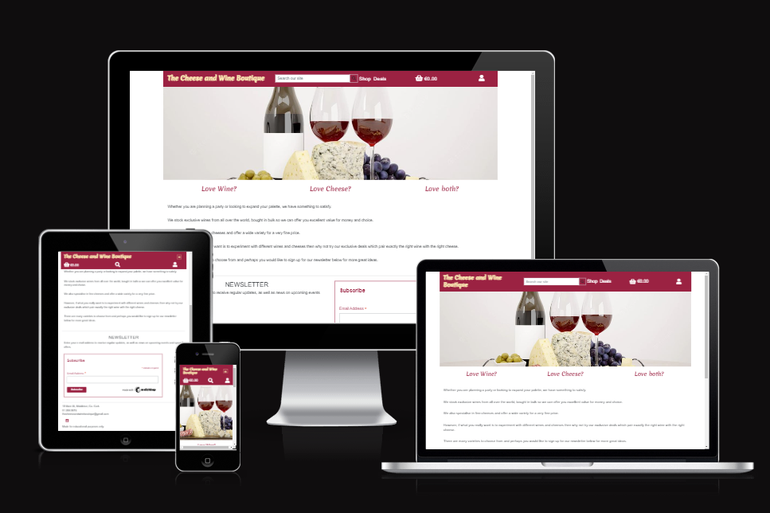
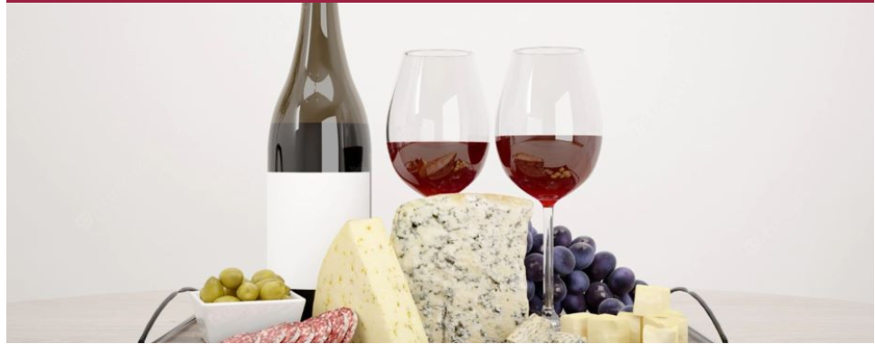
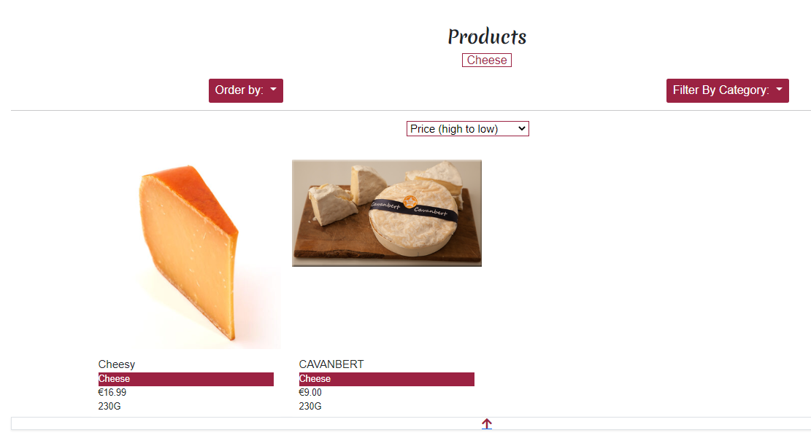
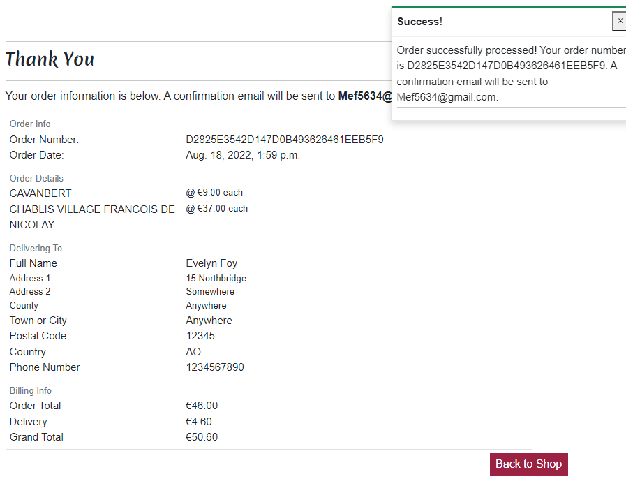

# The Cheese and Wine Boutique

 

[View the live project here.](https://the-cheese-and-wine-boutique.herokuapp.com/)

## User Experience (UX)

### Purpose

 
The purpose of this project is to build an e-commerce site for the fictional cheese and wine business of the "Wilsons".

They import exclusive cheese and wines from all over the world and need an online outlet which displays their wares and provides     
a secure means for customers to buy them.

One of their selling points is that they offer cheese and wine deals of a selected wine and cheese package sold together for a discounted price.    
This is to encourage customers to try new products.

They also want to be able to offer a newsletter telling their customers all about the latest products they have discovered and are keen to share.
  
 

### Target Audience
The target audience will be adults looking to explore the world of cheese and wine.  

They will be curious about new offerings and combinations they have not tried before. They may want advice on what to choose    
and so will need to be able to contact the site owners.

They would be interested in trying the cheese and wine package deals or new suggestions in a newsletter.

The site’s audience would also be people looking for gifts or to buy for a party.

 

### User stories by Epic

-   #### EPIC - Home App

    As a **(role)** I can **(capability)**, so that **(received benefit)**
    | No. | As a **(role)**        | I can **(capability)**         | so that **(received benefit)**  |
    | --- | ------------- |-------------| -----|
    | [#15](https://github.com/evelynfoy/the-cheese-and-wine-boutique/issues/15)  | Shopper |  register for an account | I can have a personal account and be able to view my profile |
    | [#17](https://github.com/evelynfoy/the-cheese-and-wine-boutique/issues/17)  | Shopper |  login/logout of my account | I can access my personal profile |
    | [#18](https://github.com/evelynfoy/the-cheese-and-wine-boutique/issues/18)  | Shopper |  recover my password | I can recover if I forget it |
    | [#19](https://github.com/evelynfoy/the-cheese-and-wine-boutique/issues/19)  | Shopper |  receive an email confirmation after registering | I can be confident my account has been created |
    | [#20](https://github.com/evelynfoy/the-cheese-and-wine-boutique/issues/20)  | Shopper |  subscribe to a newsletter | I can get it sent out to me |
    | [#29](https://github.com/evelynfoy/the-cheese-and-wine-boutique/issues/29)  | Shopper |  view the home page  | I can judge if I am interested

-   #### EPIC - Products App

    As a **(role)** I can **(capability)**, so that **(received benefit)**
    | No. | As a **(role)**        | I can **(capability)**         | so that **(received benefit)**  |
    | --- | ------------- |-------------| -----|
    |  [#1](https://github.com/evelynfoy/the-cheese-and-wine-boutique/issues/1)  | Store Owner | add a cheese product | I can sell it in my store |
    |  [#2](https://github.com/evelynfoy/the-cheese-and-wine-boutique/issues/2)  | Store Owner | edit a cheese product | I can update the details, price etc |
    |  [#3](https://github.com/evelynfoy/the-cheese-and-wine-boutique/issues/3)  | Store Owner |  delete a cheese product | I can stop offering it for sale |
    |  [#4](https://github.com/evelynfoy/the-cheese-and-wine-boutique/issues/4)  | Store Owner |  add a wine product | I can sell it in my store |
    |  [#5](https://github.com/evelynfoy/the-cheese-and-wine-boutique/issues/5)  | Store Owner |  edit a wine product | I can keep the details accurate |
    |  [#6](https://github.com/evelynfoy/the-cheese-and-wine-boutique/issues/6)  | Store Owner |  delete a wine product | I can stop offering it for sale |
    |  [#7](https://github.com/evelynfoy/the-cheese-and-wine-boutique/issues/7)  | Store Owner |  add a wine and cheese deal | I can sell it in my store |
    |  [#8](https://github.com/evelynfoy/the-cheese-and-wine-boutique/issues/8)  | Store Owner |  edit a wine and cheese deal | I can keep the details accurate |
    |  [#9](https://github.com/evelynfoy/the-cheese-and-wine-boutique/issues/9)  | Store Owner |  delete a wine and cheese deal | I can stop offering it for sale |
    | [#10](https://github.com/evelynfoy/the-cheese-and-wine-boutique/issues/10)  | Shopper |  view the products | I can choose something to buy |
    | [#11](https://github.com/evelynfoy/the-cheese-and-wine-boutique/issues/11)  | Shopper |  see a detailed page for each product | I can see all the details for it |
    | [#12](https://github.com/evelynfoy/the-cheese-and-wine-boutique/issues/12)  | Shopper |  sort the list of available products | I can easily find the best choice |
    |[#13](https://github.com/evelynfoy/the-cheese-and-wine-boutique/issues/13)  | Shopper |  sort a specific category of product  | I can find the best choice of wine or cheese |
    | [#14](https://github.com/evelynfoy/the-cheese-and-wine-boutique/issues/14)  | Shopper |  search for a product by name or description  | I can more easily find something more specific |
    
-   #### EPIC - Bag App

    As a **(role)** I can **(capability)**, so that **(received benefit)**
    | No. | As a **(role)**        | I can **(capability)**         | so that **(received benefit)**  |
    | --- | ------------- |-------------| -----|
    | [#21](https://github.com/evelynfoy/the-cheese-and-wine-boutique/issues/21)  | Shopper |  add products to a virtual shopping bag | I can purchase more than one item |
    | [#22](https://github.com/evelynfoy/the-cheese-and-wine-boutique/issues/22)  | Shopper |  see a running total of the value of my shopping bag | I can decide if I want to spend more |
    | [#23](https://github.com/evelynfoy/the-cheese-and-wine-boutique/issues/23)  | Shopper |  see all the items in my shopping bag | I can ensure I am happy to proceed |
    | [#24](https://github.com/evelynfoy/the-cheese-and-wine-boutique/issues/24)  | Shopper |  adjust the quantity of any product in my bag | I can decide on the right amount |
    | [#25](https://github.com/evelynfoy/the-cheese-and-wine-boutique/issues/25)  | Shopper |  remove products from my bag | I can decide not to buy them |

-   #### EPIC - Checkout App

    As a **(role)** I can **(capability)**, so that **(received benefit)**
    | No. | As a **(role)**        | I can **(capability)**         | so that **(received benefit)**  |
    | --- | ------------- |-------------| -----|
    | [#26](https://github.com/evelynfoy/the-cheese-and-wine-boutique/issues/26)  | Shopper |  view an order confirmation after checkout | I can ensure I haven't made a mistake |
    | [#27](https://github.com/evelynfoy/the-cheese-and-wine-boutique/issues/27)  | Shopper |  purchase a product securely | I can get it sent out to me |
    | [#28](https://github.com/evelynfoy/the-cheese-and-wine-boutique/issues/28)  | Shopper |  receive an email confirmation after purchasing | I can have a record of the transaction |

-   #### EPIC - Profile App
    
    As a **(role)** I can **(capability)**, so that **(received benefit)**
    | No. | As a **(role)**        | I can **(capability)**         | so that **(received benefit)**  |
    | --- | ------------- |-------------| -----|
    | [#16](https://github.com/evelynfoy/the-cheese-and-wine-boutique/issues/16)  | Shopper |  have my own user profile | I can see my orders and payment information |

### Design
-   #### Colour Scheme
    The main colour I have chosen for the site is wine red, representative of what the site sells.    
    It is a warm decadent colour which tones well with a cream cheese colour also reflecting what the site sells.  
    I have added an additional green colour, advertised on [colorcode.io](https://colorcodes.io/red/wine-red-color-codes/)  as a complementary colour for the wine red, to add an extra contrasting colour.   
    I have kept the body white with dark writing for good contrast.

    Here is the colour palete generated on [Colormind](http://colormind.io/).
       

-   #### Typography
    I decided to go for the [Merienda One](https://fonts.google.com/specimen/Merienda+One?query=Merienda+One#about) font from [Google fonts](https://fonts.google.com/) for the logo to give a flourish.     
    According to Google fonts 'It is ideal for headlines which call for height, as its strokes resemble those of a brush and deliver freshness and a dynamic touch in the development of words.'    
    I decided to go with [Open Sans](https://fonts.google.com/specimen/Open+Sans?query=Open+sans#about) font for the rest of the site as it is easy to read and looks good.     
    According to [Google fonts](https://fonts.google.com/) 'It is optimized for print, web, and mobile interfaces, and has excellent legibility.    
                 
-   #### Imagery
    I will add icons from [font awesome](https://fontawesome.com/) where appropriate and photos of the products on sale.
    I will also add an appropriate image to the home page featuring cheese and wine to create interest and ensure the purpose of the site is immediately evident.    

### Wireframes
The wireframes below were generated using [Balsamic](https://balsamiq.com/wireframes/ "Balsamic").
-   #### [Home - Desktop](docs/wireframes/home-desktop.png "Home Desktop wireframe")
-   #### [Home - Phone](docs/wireframes/home-phone.png "Home Phone wireframe")
-   #### [Home - Tablet](docs/wireframes/home-tablet.png "Home Tablet wireframe")
-   #### [Product Description - Desktop](docs/wireframes/product-description-desktop.png "Product Description Desktop wireframe")
-   #### [Product Description - Phone - Tablet](docs/wireframes/product-description-phone-tablet.png "Product Description Phone & Tablet wireframe")
-   #### [Products - Desktop](docs/wireframes/products-desktop.png "Product Description Desktop wireframe")
-   #### [Products - Phone - Tablet](docs/wireframes/products-phone-tablet.png "Products Phone & Tablet wireframe")
-   #### [Register](docs/wireframes/register.png "Register wireframe")
-   #### [Login](docs/wireframes/login.png "Login wireframe")
-   #### [View Basket - Desktop](docs/wireframes/basket-desktop.png "View Basket Desktop wireframe")
-   #### [View Basket - Phone - Tablet](docs/wireframes/basket-phone-tablet.png "View Basket Phone & Tablet wireframe")

### Marketing Strategy and E-commerce Business Model
The Ecommerce Business Model for this project is Business to Consumer as it is for a business targeting ordinary people as customers.

The marking strategy I consider best meets the needs of the Wilsons is as follows:
-   Use of SEO    
    I will employ SEO optimisation techniques and implementations such as semantic markup, keywords and metadata so the site ranks highly with Google.    
    I will also include a site map and robots.txt file to assist the search engines.
-   Content marketing    
    This will be achieved by using keywords in the content of the site and also offering interesting deals which will change constantly, provide interest and promote various products.
-   Email Marketing    
    A form will be provided where visitors can sign up for a newsletter which will contain interesting information about new products and offerings.
-   Social Media Marketing    
    A link to the business' Social Media pages will be included to encourage organic growth.    
    These screenshots were taken from the mock facebook page I created for this project.
    
    
    
    

  

## Project Structure

 

### Data Schema

###     
###     

&nbsp;  

### Models

#### Category

| Name          | Type | Key       | Other          |
|---------------|------|-----------|----------------|
| name          |      | CharField | max_length=254 |
| friendly_name |      | CharField | max_length=254 |

#### Product

| Name        | Type            | Key                 | Other                                  |
|-------------|-----------------|---------------------|----------------------------------------|
| category    | OneToMany       | ForeignKey(Product) | on_delete=models.CASCADE               |
| sku         | CharField       |                     | max_length=254, null=True, blank=True  |
| name        | CharField       |                     | max_digits=6, decimal_places=2         |
| description | TextField       |                     |                                        |
| price       | DecimalField    |                     | max_digits=6, decimal_places=2         |
| size        | CharField       |                     | max_length=254                         |
| image_url   | URLField        |                     | max_length=1024, null=True, blank=True |
| image       | CloudinaryField |                     | default='placeholder'                  |

#### Cheese

This model has a one to one relationship with the product model.    
Each product can have an entry in the cheese table if it is a cheese category type.

| Name        | Type      | Key                    | Other                                |
|-------------|-----------|------------------------|--------------------------------------|
| Product     | OneToOne  | OneToOneField(Product) | on_delete=models.CASCADE             |
| Milk        | CharField |                        | max_length=20, null=True, blank=True |
| Region      | CharField |                        | max_length=20, null=True, blank=True |
| Rennet      | TextField |                        | max_length=20, null=True, blank=True |
| Cheese Type | CharField |                        | max_length=20, null=True, blank=True |
| Age         | CharField |                        | max_length=20, null=True, blank=True |

#### Wine

This model has a one to one relationship with the product model.    
Each product can have an entry in the wine table if it is a wine category type.

| Name              | Type      | Key                    | Other                                             |
|-------------------|-----------|------------------------|---------------------------------------------------|
| Product           | OneToOne  | OneToOneField(Product) | on_delete=models.CASCADE, one to one relationship |
| Origin            | CharField |                        | max_length=20, null=True, blank=True              |
| Grape             | CharField |                        | max_length=20, null=True, blank=True              |
| Wine Type         | TextField |                        | max_length=20, null=True, blank=True              |
| Production Method | CharField |                        | max_length=20, null=True, blank=True              |

#### Deal

This model has three one to one relationships with the product model.    
Each product can have an entry in the deal table if it is a deal category type.    
Then two other products can be associated with the deal. They can be any mix of cheese or wines    
e.g. 2 cheeses, a wine and a cheese or two wines.  

| Name    | Type      | Key                    | Other                                             |
|---------|-----------|------------------------|---------------------------------------------------|
| Product | OneToOne  | OneToOneField(Product) | on_delete=models.CASCADE, one to one relationship |
| Product | OneToOne  | OneToOneField(Product) | on_delete=models.CASCADE, one to one relationship |
| Product | OneToOne  | OneToOneField(Product) | on_delete=models.CASCADE, one to one relationship |

### Agile Methodology
[Github issues](https://github.com/evelynfoy/the-cheese-and-wine-boutique/issues) were used to manage the development of this project. I set up a [project backlog](https://github.com/evelynfoy/the-cheese-and-wine-boutique/milestones) milestone containing all the issues at the start.    
Then I set up a [kanban board]( https://github.com/evelynfoy/the-cheese-and-wine-boutique/projects/1) for the project and each week I created a new milestone to use to complete an agile sprint and moved in a number of issues to complete.    
I prioritised the issues according to the MoSCoW technique and labeled them as such. Any issues outstanding at the end of the sprint were moved to the next sprint.    
Here is a screenshot at the end of the first sprint and the beginning of the second.    
 

I used branches to implement all user stories and pull requests to merge the work into the main branch.
Minor tweaks and documentation was done on the main branch. 

## Existing Features
The site consists of a home page featuring a hero image, an inspirational text area, a newsletter signup form and a footer.    
It has a navbar which displays the site name and options to register, login, shop or view the contents of a virtual shopping basket.     
It also includes a search bar and a menu option to filter the products on deals only. This is to encourage users to try new products.   
The shop option displays the products available for purchase at the store and allows the user to add a specified quantity of the item to the virtual shopping basket.    
There is a running total of the basket displayed at all times and the contents can be viewed or adjusted as required.    
From the basket the checkout button provides the means for the user to purchase the items in a secure way using stripe payments.
The user can register and login to view their orders and save their personal information or shop annoynmously.
The site owner can also maintain the product list once logged in. 

### Navigation Bar

The navigation bar is fixed in position at the top of the page.
It includes 
1) The company logo which is also a link to the home page.
2) Links to the other available pages on the site e.g. the shop or products, the basket and the user options which vary on login.
3) A running total of the contents of the customers virtual shopping basket. This doubles as a link to the basket page.
4) A search bar to search through all the products name and description.

The user options are represented by a font awesome icon which on click displays a dropdown menu with the following options:-
1) If the user is staff then Project Administration.
2) If user signed in then the user name is displayed and a logout link
3) If no user is logged in then both a register and login option are presented.

The navigation bar is fully responsive and the links are replaced on smaller screens with a hamburger icon.    
The User options, search and basket total move to the next line.

### Search box
-   The search box beside the logo alows searching of the products name and description for a keyword.    
-   This drops to the second line on smaller screens so it is always easily accessible.
-   This example shows the results of the search for the cheese keyword. The wine is shown also because it has the word cheese in its description.

### Hero Image

-   The landing page image is an inticing photograph of a selection of wine and cheese which features a zoom in affect on page load.

### Inspirational Section

-   This area features headings and text to interest the user in the site and entice them to explore further.

### The Subscribe to Newsletter Section

-   This section invites the user to subscribe to the businesses newsletter by entering their email address.    
    It uses an email marketing company called Mailchimp to provide this service.

### Footer

-   The footer features the businesses address and email and a link to their facebook page.

### Shop

-   This page displays all the products that are available to purchase on the site.
-   There are three different types of product.
    -   Cheese
    -   Wine
    -   Deal
-   Each type holds different kinds of information on the product e.g. milk for cheeses or grape for wine.
-   The Deal type allows the business owner to package two items together for a special price. This could    
    be two cheeses, two wines or a wine and a cheese.

-   This page also has a filter and sort feature which allows users to display the products in a certain category only
    e.g. cheese  or to sort them in a particular order
-   The `Sort within Category` dropdown provides the users with the ability to sort within category e.g. sort cheeses by desc price.
-   Selecting the `Order by dropdown` of `All Products` clears the filter.

### Product Details

-   Clicking on a product displays the full details for that item.
-   Only the appropriate details appear for the product e.g. cheese details for cheeses etc.
-   Also, only filled in details are shown. Blank fields are not displayed on the screen.
-   There is a quantity field that takes a number and an `Add to basket` button to select this product for purchase.
-   The user can type in an amount or use the arrow buttons which don't go below 1.
-   When an item is added to the basket a success message appears informing the user.    
-   It also summarises the contents of the basket and shows the total excluding delivery.    
-   There is also a button to go to checkout. A secure payment facilitiy is indicated by displaying a lock item on the button.
-   The message can be dismisses by clicking the x but it also disappears by itself after a few seconds.

### Product Administration

-   This menu option is available to staff only.
-   It allows products to be added.

-   The Category is a drop down menu offering three choices.    
    These categories can be maintained by the owner who can add more if required via the django admin screen.
-   The details requested differ depending on which category is chosen.    
    Choosing the cheese category displays the cheese related details.    
    Choosing the wine category displays the wine related details.     
    Choosing the deal category allows two items to be selected from a dropdown menu.
-   There are a core set of details requested for all products e.g. price.   

    If a category other than cheese,wine or deal is made available then only the core details will be displayed.    
    These core details include loading an image which is displayed on the products and product details page.    
    If no image is loaded a default placeholder image is displayed instead.

-   There is a cancel button provided and an add button to proceed with the add action.

-   The product details page also has an edit and delete link for staff only (superusers) from which they can edit and delete products.
-   Feedback messages are sent on completion of actions

### Authentication

-   If the user is not logged in then they have the option to either register or login.
-   If the user is logged in they have the option to logout.

### Shopping Basket

-   If the users virtual shopping basket is empty then this page will just display a message that the basket is empty and     
    provide a link back to the Shop or Products page.

    

-   If there are items in the basket then these are listed displaying the core details for the product and the quantity selected.    
    A small image of the product is displayed.    
    The sub-total is displayed (Quantity * Price).    
    At this point the user can change the quantity of any item in the basket or remove it entirely.    
    If the quanity is changed then the sub-total is recalculated and a feedback message displayed.    
    The basket total is also displayed with the delivery charge and the grand total.    
    These are re-calulated as item quantities change.    

-   There is a button link back to the shop or product page and a button link to continue to checkout.    

   
   

### Checkout

-   The checkout page provides a form for users to fill in with their details.
-   It also contains a summary of the items in the basket which will be used to create the order.
-   The totals for the order are displayed.
-   A stripe card element is used on this page to collect the card details.    
    Javascript is used to 
    1) Mount and style the card element
    2) Display any feedback errors received
    3) Handle form submit
-   There is a button provided for confirming the payment. It displays a lock icon to indicate security. 
-   There is also a little summary message in red displayed with the total amount that will be charged to the card on confirming the payment.
-   There is a button link provided at this point to return to the basket for making adjustments.
-   If logged in the user can choose to save their delivery details which are defaulted on the checkout page for them.

   
   
   

-   If the card details are incorrect an error message is displayed    
   

-   If the details are correct a spinner is displayed while the order is being processed.
   

### Checkout confirmation

-   The checkout confirmation page provides a summary of the order for users and a link back to the shop.

  
  

 
### Deals

-   This is the second option from the nav menu which takes users directly to the products filtered by deals.    
-   This feature is designed to grab the attention of site visitors and entice them to see what is on offer.

  

### My Profile

-   The profile page allows the user to edit their delivery details and view their previous orders.
-   A feedback message is sent when the profile is updated.

  

-   On clicking the order number the confirmation screen is shown with a button back to the profile page

  

## Technologies Used

### Languages
* HTML
* CSS
* Python

### Libraries & Framework
* Django
* Stripe
* Coudinary

### Tools
* [Balsamic](https://balsamiq.com/wireframes/ "Balsamic")
* [Google Fonts](https://fonts.google.com/ "Google Fonts")
* [Font Awesome](https://fontawesome.com/ "Font Awesome icons" )

## Testing
My testing aproach included:
-   Writing and testing [automated tests](docs/testing/automated-testing.md "Automated Testing") for some functionality as the functionality is written.
-   [User Stories Testing](docs/testing/user-story-testing.md) is performed when a user story is complete and used as a measure that it is ready to be merged into the main application. 
    It involves confirming that the acceptance tests listed in the user story in github were passed.
-   Once all the user stories were done I created a [SPIKE](https://github.com/evelynfoy/the-cheese-and-wine-boutique/issues/42) issue listing all the pages that needed testing and also different versions of pages e.g. Mobile, Desktop
-   I then throughly tested all the pages listed and tried to break the application. All issues resulting from this were added as issues in github.
-   I prioritized them and worked through as many as I had time for.
-   These bugs are listed in the [Manual Tests area](docs/testing/additional-bug-testing.md)

### Code Validation

#### HTML Validator
The W3C Markup Validator was used to validate every page of the project to ensure there were no syntax errors in the project.
  - No errors were returned when passing through the official [W3C validator](https://validator.w3.org/nu/?doc=https%3A%2F%2Fthe-cheese-and-wine-boutique.herokuapp.com%2F)
  - See [Results](docs/images/testing/html-validation-results.png)

#### CSS Validator (Jigsaw)
  - No errors were found when passing through the official [(Jigsaw) validator](https://jigsaw.w3.org/css-validator/validator?uri=https%3A%2F%2Fthe-cheese-and-wine-boutique.herokuapp.com%2F&profile=css3svg&usermedium=all&warning=1&vextwarning=&lang=en)
  - See [Results](docs/images/testing/css-validation-results.png)

#### Javascript (jshint)
| Name                 | image | Result |
|----------------------|-------|--------|
| countryfield.js       | [Results](docs/testing/jshint/country-field.png)     | Recommended using esversion 6
| stripe_elements.js    |  [Results](docs/testing/jshint/stripe-elements.png)  | Recommended using esversion 6   
| products.js           |  [Results](docs/testing/jshint/products.png)         | Had 2 missing semi-colons - corrected   
| products-edit.js      |  [Results](docs/testing/jshint/products-edit.png)    | No errors   

#### Python (Pep8) - 
Results from http://pep8online.com/

| App    | Name                 | image | Result |
|--------|----------------------|-------|--------|
| Basket | contexts.py  | [Results](docs/testing/pep8/basket-contexts.png)     | All right  
| Basket | views.py   |  [Results](docs/testing/pep8/basket-views.png)  | All right  
| Basket | urls.py           |  [Results](docs/testing/pep8/basket-urls.png)         | All right  
| Products | models.py      |  [Results](docs/testing/pep8/products-models.png)    | All right   
| Products | views.py      |  [Results](docs/testing/pep8/products-views.png)    | One line too long   
| Products | forms.py      |  [Results](docs/testing/pep8/products-forms.png)    | No errors  
| Profile | models.py      |  [Results](docs/testing/pep8/profiles-models.png)    | No errors   
| Profile | views.py      |  [Results](docs/testing/pep8/profiles-views.png)    | No errors  
| Profile | forms.py      |  [Results](docs/testing/pep8/profiles-forms.png)    | No errors  
| Checkout | models.py      |  [Results](docs/testing/pep8/checkout-models.png)    | Two lines too long   
| Checkout | views.py      |  [Results](docs/testing/pep8/checkout-views.png)    | No errors  
| Checkout | forms.py      |  [Results](docs/testing/pep8/checkout-forms.png)    | No errors  
| Checkout | signals.py      |  [Results](docs/testing/pep8/checkout-signals.png)    | No errors  

In most cases I split lines that were too long but a few were more awkward to split so I left them alone rather than risking breaking the application.    
This is something I would sort out with more time.

#### Lighthouse 
- Accessibility score 98 
    - search and user profile links do not have discernable name
    - this could probably be resolved using aria-labelling but I did not have time prior to submission
- SEO score 100
- Best Practises score 83 is a bit low as it seems to have some issues with jquery vulnerabilities which I will investigate further.
- See [Results](docs/testing/lighthouse.png)
 

### Automated Tests
- The automated testing details are contained [here](docs/testing/automated-testing.md "Automated Testing").   

### Testing User Stories from User Experience (UX) Section

See [User Stories Testing](docs/testing/user-story-testing.md)

### Manual Tests

See [Additional Issue or Bug Testing](docs/testing/additional-bug-testing.md)

## Deployment

- The complete deployment details are contained [here](docs/deployment.md "deployment").   

## Credits

### Code
* [Simen Daehlin](https://github.com/Eventyret "Simen Daehlin") for code inspiration, help and advice.
* [Stack Overflow](https://stackoverflow.com/ "Stack Overflow") for help and assistance.
* [Code Institute](https://codeinstitute.net/ie/ "Code Institute") for help and inspiration from the run through projects. 

### Content
[Sheridans Cheesemongers](https://sheridanscheesemongers.com/)

### Media
*   [Sheridans Cheesemongers](https://sheridanscheesemongers.com/)    
*   [Hero Image from alexandercho](https://img.freepik.com/free-psd/delicious-cheese-assortment-with-red-wine-mockup_176382-104.jpg?w=1480&t=st=1659894641~exp=1659895241~hmac=2daa777a05dc4086f228b30c3eb32635a86d90518bfe9f9ad745bb0a012933b2) - requested link <a href="https://www.freepik.com/psd/wine-mockup">Wine mockup psd created by alexandercho - www.freepik.com</a>    

